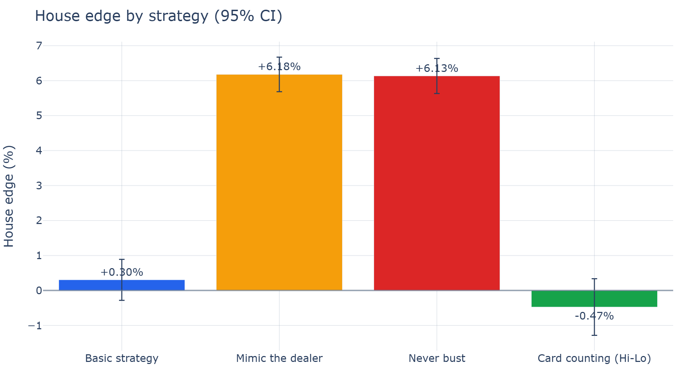
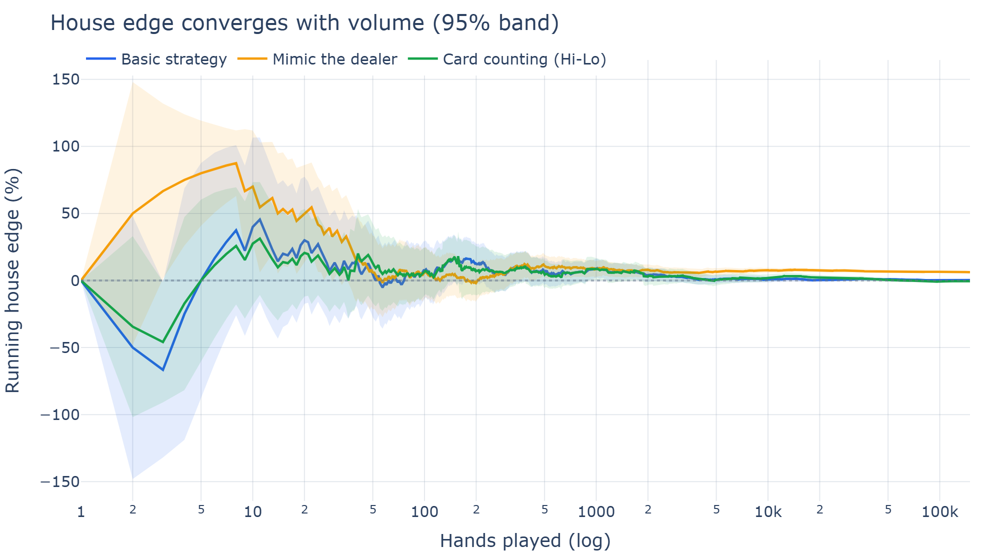
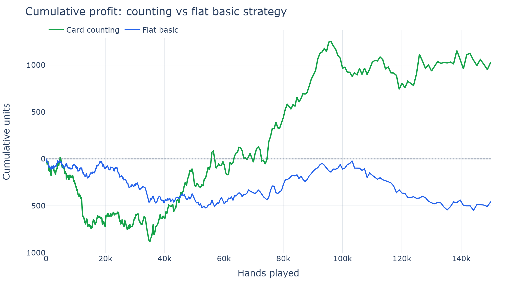

# 🃏 Blackjack Monte Carlo EV Simulator

[](https://blackjack-ev-simulator-6vp4ztjkn37bauil43fipu.streamlit.app/)
&nbsp;


A Monte Carlo simulation engine that deals **millions of blackjack hands** to
quantify the house edge, compare playing strategies, stress-test betting
systems, and demonstrate how **card counting** turns the advantage to the
player — all behind an interactive Streamlit dashboard with full statistical
rigor (means, standard errors, and 95% confidence intervals).

**▶ Try it live: [blackjack-ev-simulator.streamlit.app](https://blackjack-ev-simulator-6vp4ztjkn37bauil43fipu.streamlit.app/)**



## Why this project

It's a compact but complete data/ML showcase:

- **Simulation & statistics** — a correct game engine plus law-of-large-numbers
  convergence, standard error, and confidence intervals computed from scratch.
- **A real, falsifiable result** — the simulator reproduces blackjack's known
  ~0.4–0.5% house edge, which validates the engine against theory.
- **A clear narrative** — "intuitive" strategies cost 10×+ more than optimal
  play, popular betting systems can't beat the edge, and counting can.
- **Clean architecture** — the game engine is fully decoupled from bet-sizing,
  so strategies and betting systems compose independently.

## Headline findings

| Strategy | House edge | Verdict |
|---|---|---|
| **Basic strategy** | ~0.4% | near break-even — the benchmark |
| Mimic the dealer | ~6% | costs ~12× more than basic |
| Never bust (stand on hard 12+) | ~6% | costs ~12× more than basic |
| **Card counting (Hi-Lo + bet spread)** | **negative** | a genuine player edge |

**Betting systems** (Martingale, Fibonacci, D'Alembert, Paroli) reshape
*variance* but never *expectation*. Martingale produces frequent small wins and
rare catastrophic losses — in simulation its **median session ends at zero with
a ~70%+ risk of ruin**, even when the average looks deceptively flat.

| Edge convergence | Counting vs flat |
|---|---|
|  |  |

## Quick start

```bash
python -m venv .venv
.venv\Scripts\activate        # Windows  (use: source .venv/bin/activate on macOS/Linux)
pip install -r requirements.txt
streamlit run app.py
```

The dashboard has four tabs:

1. **Strategy comparison** — house edge per strategy with 95% CI error bars.
2. **Edge convergence** — running edge vs. hands played, with a shrinking
   confidence band (the law of large numbers, visualized).
3. **Betting systems** — bankroll trajectories, final-bankroll distributions,
   and risk-of-ruin for each progression system.
4. **Card counting** — the Hi-Lo bet ramp and cumulative profit vs. flat play.

A **rule-set configurator** in the sidebar lets you change the deck count,
S17/H17, 3:2 vs 6:5 payout, DAS, and penetration, then watch every edge update
live — e.g. switching a 3:2 game to 6:5 adds ~1.4% to the house edge.

To regenerate the static charts in `assets/`:

```bash
python scripts/make_charts.py
```

## How it works

### Table rules (the documented default)
6-deck shoe · dealer **stands on soft 17** · blackjack pays **3:2** · double on
any two cards · **double after split** · re-split to 4 hands (split aces get one
card) · ~75% penetration. Under these rules perfect basic strategy faces a
~0.4% house edge — the number the simulator reproduces as a sanity check.

### Architecture

```
blackjack/
├── rules.py       # the table rule set
├── strategy.py    # basic-strategy chart, 4 player strategies, Hi-Lo + Illustrious 18
├── engine.py      # shoe with a live running count; play one round (splits/doubles/naturals)
├── betting.py     # Martingale / Fibonacci / D'Alembert / Paroli + the counting bet spread
├── simulate.py    # Monte Carlo runners (flat, counting, betting-system trajectories)
└── stats.py       # mean, std, standard error, 95% CI, convergence diagnostics
app.py             # Streamlit dashboard
scripts/make_charts.py   # render the static PNGs used above
```

The key design decision: **the engine returns each round's result in units of
the base bet**, so doubles and splits already scale it. Bet sizing — flat,
a progression system, or a count-based spread — is a separate layer that simply
multiplies. This keeps strategies and money-management fully independent.

### Statistical approach

Every reported edge is a Monte Carlo estimate of the mean result per hand. The
standard error is `std / √n`, and 95% confidence intervals use the normal
approximation (`±1.96 · SE`), valid here because each simulation aggregates
hundreds of thousands of independent rounds.

## Card counting in detail

The counter runs the **Hi-Lo** system (+1 for 2–6, 0 for 7–9, −1 for tens and
aces), normalises to a *true count* per remaining deck, and layers three things
on top of basic strategy:

- a **bet spread** that ramps from 1 unit up to a capped maximum as the true
  count rises;
- **insurance** taken at a true count of +3 or higher (the single most valuable
  index play, since a ten-rich shoe makes the side bet +EV);
- the **Illustrious 18** index deviations — the 18 highest-value departures from
  basic strategy (e.g. stand on 16 vs 10 at TC ≥ 0, take 12 vs 3 at TC ≥ 2).

Together these flip the expectation from a ~0.5% house edge to a small but real
**player advantage** (~0.3–0.5% with a 1–8 spread at 75% penetration).

## Methodology notes & honest limitations

- Playing deviations are limited to the Illustrious 18; rarer index plays (the
  rest of the "Fab 4" / full index set) are not modeled, so the counter's edge
  is a slight underestimate.
- The model assumes perfect play with no betting errors, no "heat" from the
  casino, and no table-conditions noise — i.e. an idealized environment.
- Surrender is not implemented (omitted from the default rule set).


---

Built with NumPy · pandas · Streamlit · Plotly.
